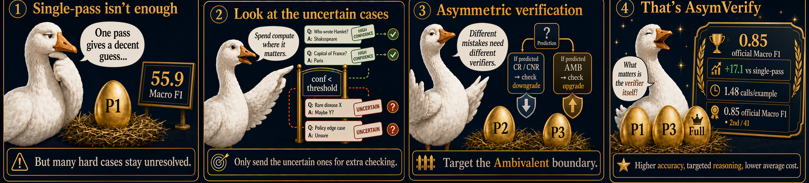
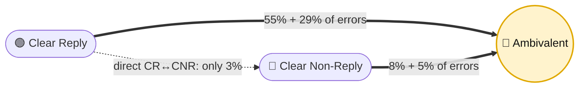
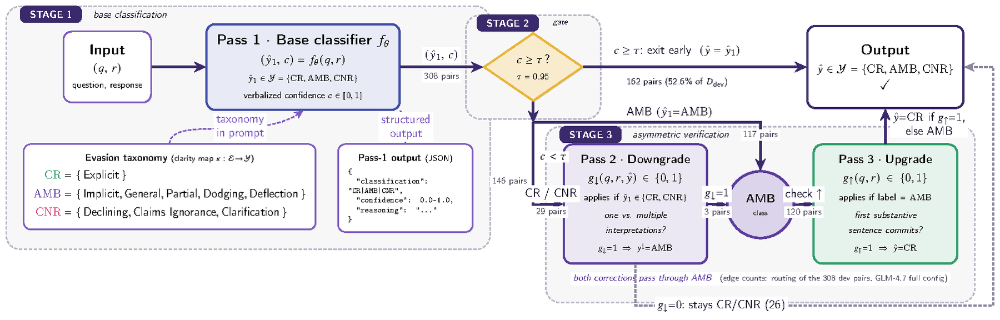
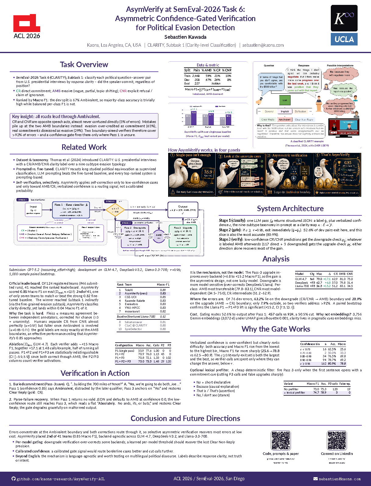
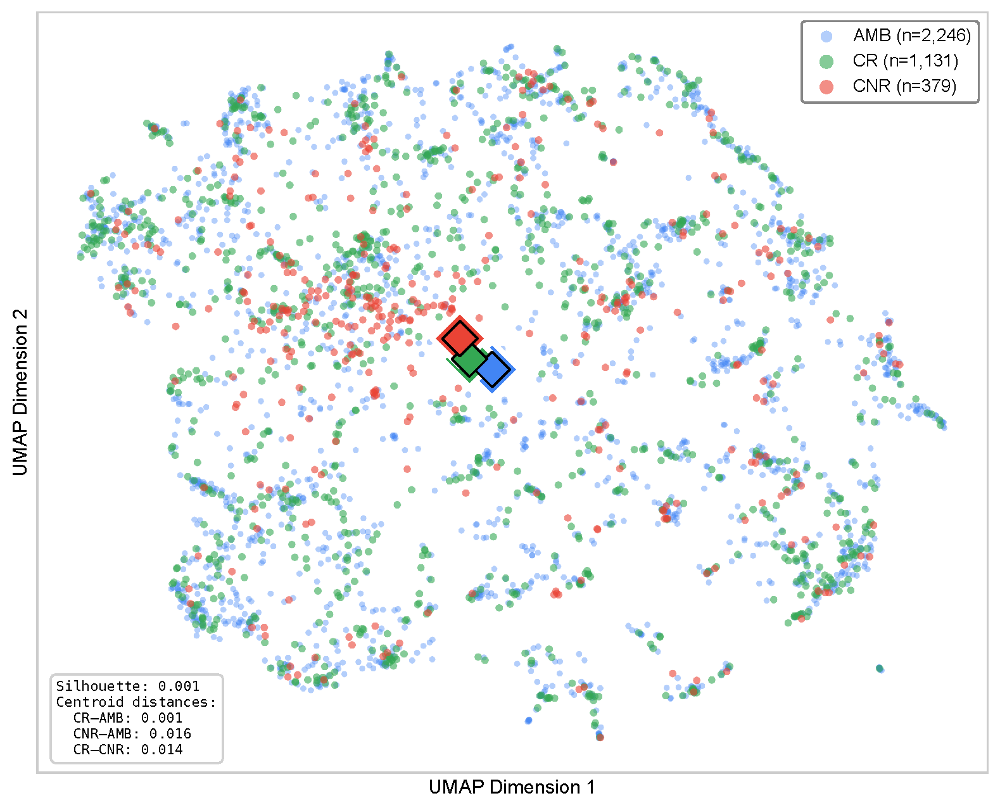

<div align="center">

<a href="https://2026.aclweb.org/"></a>
&nbsp;&nbsp;&nbsp;&nbsp;
<a href="https://kaons.com/"></a>
&nbsp;&nbsp;&nbsp;&nbsp;
<a href="https://www.ucla.edu/"></a>

<br/><br/>

# AsymVerify

### Asymmetric Confidence-Gated Verification for **Political Evasion Detection**

**Sebastien Kawada**

<sub>Kaons · SemEval-2026 Task 6 (CLARITY) · published at [SemEval-2026 @ ACL 2026](https://aclanthology.org/2026.semeval-1.202/), San Diego</sub>

<br/>

**Evasive answers look cooperative while committing to nothing.** AsymVerify reads each
political question–answer exchange, then spends extra LLM verification *only* where it is
unsure, and *only* in the two directions the errors actually travel.

<br/>

[](https://aclanthology.org/2026.semeval-1.202/)
[](paper/main.pdf)
[](poster/poster.pdf)
[](https://konstantinosftw.github.io/CLARITY-SemEval-2026/)

[](#-headline-result)
[](#-headline-result)
[](#-headline-result)

[](requirements.txt)
[](LICENSE)


</div>

---

> **TL;DR.** Political evasion is hard to detect because evasive answers *look* cooperative
> while avoiding any concrete commitment. AsymVerify classifies each question–answer pair as
> **Clear Reply**, **Ambivalent**, or **Clear Non-Reply**, then applies extra verification
> *only* to low-confidence cases, and *only* in the two directions errors actually go.
> On the development set, **>90% of errors sit at the Ambivalent boundary** (AMB→CR 55%,
> CR→AMB 29%; direct CR↔CNR just 3%), so two cheap asymmetric verifiers (both correcting
> *through* AMB) recover most of the gap. The result: **0.85 Macro F1, 2nd of 41 teams** on
> the official CLARITY Subtask 1 split (one of only seven to clear the strong baseline, from 124
> registered teams), and **+17.1 Macro F1** over single-pass classification at **1.48 calls/example**,
> roughly half the cost of running every pass on every example.

<div align="center">

**[The idea](#-the-idea-in-four-panels)** · **[How it works](#-how-asymverify-works)** · **[Headline result](#-headline-result)** · **[Poster](#-the-poster)** · **[Ablations](#-where-the-gains-come-from)** · **[Quickstart](#-quickstart)**

</div>

---

## Contents

- [The idea, in four panels](#-the-idea-in-four-panels)
- [Why evasion is hard](#-why-evasion-is-hard)
- [How AsymVerify works](#-how-asymverify-works)
- [Headline result](#-headline-result)
- [The poster](#-the-poster)
- [Why asymmetric verification works](#-why-asymmetric-verification-works)
- [Where the gains come from](#-where-the-gains-come-from)
- [It's the mechanism, not the model](#-its-the-mechanism-not-the-model)
- [Cheaper by design: confidence gating](#-cheaper-by-design-confidence-gating)
- [Why not embeddings?](#-why-not-embeddings)
- [Verification in action](#-verification-in-action)
- [Quickstart](#-quickstart)
- [Command-line usage](#-command-line-usage)
- [Reproduce the paper](#-reproduce-the-paper)
- [Repository layout](#-repository-layout)
- [Citation](#-citation)
- [License](#-license)

---

## ✦ The idea, in four panels

<div align="center">

</div>

One pass gives a decent guess, but many hard cases stay unresolved. So send *only the
uncertain ones* for extra checking, and give each predicted label the *specific* verifier
that catches its failure mode. That is the whole system; the rest of this page is the
evidence.

---

## ✦ Why evasion is hard

A skilled political dodge *appears* substantive: it engages the topic, sounds informative,
and commits to nothing. Worse, preference-optimized LLMs lean toward **agreeable, user-aligned
readings**, exactly the sycophantic bias that evasion detection must resist. The task is to
decide not *what* position was taken, but *whether a commitment was made at all*.

SemEval-2026 Task 6 (CLARITY) frames this as three-way classification over a nine-subtype
evasion taxonomy:

| Class | Subtypes | Example signal |
|:--|:--|:--|
| 🟢 **Clear Reply** (CR) | Explicit | yes/no, numbers, names, dates, a stated position |
| 🔵 **Ambivalent** (AMB) | Implicit · General · Partial · Dodging · Deflection | engages the topic but never commits |
| 🔴 **Clear Non-Reply** (CNR) | Declining · Claims Ignorance · Clarification | *"I won't comment"*, *"I don't know"* |

The dataset is heavily **Ambivalent-skewed** (59% train, **67% dev**), so high accuracy is
cheap (just predict the majority class), but **Macro F1** (each class weighted equally) is
not. That gap is the whole problem. Even trained annotators separate CR from CNR near-perfectly
(Fleiss κ = 0.97) but agree far less once Ambivalent is involved (κ = 0.65–0.71): the gold
labels themselves are noisy exactly where the classification is hard.

### The key observation: errors live at the Ambivalent boundary

On the development set, the residual errors of a single-pass classifier are not spread
evenly. They **concentrate at the two AMB boundaries**, and the two *polar* classes are almost
never confused with each other:



<div align="center">

| Error type (gold → predicted) | Count | Share |
|:--|:--:|:--:|
| AMB → CR, *over-credited evasion* | 42 | **55%** |
| CR → AMB, *penalized hedging* | 22 | **29%** |
| AMB → CNR | 6 | 8% |
| CNR → AMB | 4 | 5% |
| CR ↔ CNR, *direct confusion* | 2 | **3%** |

<sub>76 total errors on D<sub>dev</sub> (n=308), GLM-4.7 full system. Clear Reply and Clear Non-Reply are opposite speech acts, so they collide only 3% of the time.</sub>

</div>

Because **every correction routes through AMB**, a single verifier aimed at one boundary
already recovers a large slice of the errors, which is exactly what the asymmetric design
exploits.

---

## ✦ How AsymVerify works

AsymVerify is a **confidence-gated cascade** of up to three prompt-only passes. A base
classifier reports a label *and* a verbalized confidence `c`; high-confidence predictions exit
immediately, and only the uncertain remainder pays for verification, asymmetrically in the
two directions the errors above actually travel.

<div align="center">
<a href="poster/figures/fig_arch.pdf"></a>

<sub>Edge counts show the routing of the 308 dev pairs (GLM-4.7, full configuration): 162 exit at the gate, 29 take the downgrade check, 117 + 3 take the upgrade check.</sub>

</div>

| # | Pass | Runs when | What it asks |
|:--:|:--|:--|:--|
| **1** | **Base classification** | always | Classify CR / AMB / CNR against the 9-subtype evasion taxonomy; return a label, confidence `c`, and reasoning as JSON. |
| **·** | **Confidence gate** | `c ≥ τ` (τ = 0.95) | **Exit.** 52.6% of dev examples stop here, and this slice is also the most accurate (80.9%). |
| **2** | **Downgrade verifier** | `c < τ` and label ∈ {CR, CNR} | *"One interpretation, or multiple?"* If reasonable readers could disagree about what was said, downgrade to **AMB**. |
| **3** | **Upgrade verifier** | `c < τ` and label is AMB *(incl. P2 downgrades)* | *"Does the **first substantive sentence** directly commit?"*, ignoring preambles and later hedging. If so, upgrade to **CR**. |

Two design choices fall straight out of the error analysis:

- **No AMB→CNR upgrade pass.** CNR is only 8% of the data and CNR-side errors are ~13% of the
  total, too little to recover to justify a third verifier.
- **Both verifiers correct *through* AMB**, which is why either one alone already captures a
  large, complementary share of the boundary errors.

> A guardrail from the paper: confidence here is a **routing signal**, not a calibrated
> probability: `τ` decides *who gets a second look*, not how likely the answer is correct.

---

## ✦ Headline result

CLARITY drew **124 registered teams** and **946 valid runs** for Subtask 1; **41 teams** landed a
ranked leaderboard entry, and **only seven** matched or beat the strong 0.82 fine-tuned Llama-70B
baseline. Team **AsymVerify** scored **0.85** Macro F1 on the evaluation split (D<sub>eval</sub>, n=237)
and placed **2nd of 41 teams**, within **0.04** of the winning system (0.89) and level with third place,
using a direct single-model classify-then-verify recipe rather than the taxonomy-hierarchy pipelines
the top systems relied on. The submission backend was **GPT-5.2** (`reasoning_effort=high`).

<div align="center">

| Rank | Team | Score |
|:--:|:--|:--:|
| 1 | TeleAI | 0.89 |
| 🥈 **2** | **AsymVerify** | **0.85** |
| 3 | CSE-UOI | 0.85 |
| 4 | Rasende Rakete | 0.83 |
| 5 | Evaluators | 0.83 |
| 6 | YNU-HPCC | 0.83 |
| 7 | moswisarut | 0.82 |
| 8 | tahamunawar | 0.81 |

<sub>Official CLARITY Subtask 1 leaderboard on D<sub>eval</sub> (n=237; 41 ranked teams of 124 registered). Top-8 shown; ranks 8+ fall below the baseline.</sub>

</div>

Given the annotator ceiling above (κ = 0.65–0.71 at the Ambivalent boundaries), a 0.85 Macro F1
operates close to what the label noise allows to be measured.

The sections below analyze *why* it works, on the development split (D<sub>dev</sub>, n=308)
with **GLM-4.7**.

---

## ✦ The poster

Presented at the SemEval-2026 poster session, ACL 2026, San Diego. Click through for the
full-resolution PDF (91 × 119 cm, print-ready vector).

<div align="center">
<a href="poster/poster.pdf"></a>

<sub>Sources in <a href="poster/">poster/</a>: LaTeX (beamerposter), standalone TikZ figures, and all assets. Build with <code>lualatex</code> (two passes).</sub>

</div>

---

## ✦ Why asymmetric verification works

Because errors pool at the AMB boundary, the same 76 dev errors can be re-sorted by **which
verifier direction would catch them**:

<div align="center">

| Error family | Caught by | Count | Share |
|:--|:--|:--:|:--:|
| AMB predicted as CR/CNR, *over-acceptance* | **Pass 2** (downgrade) | 48 | **63.2%** |
| CR predicted as AMB, *under-recognition* | **Pass 3** (upgrade) | 22 | **28.9%** |
| Everything else | outside both passes | 6 | 7.9% |

</div>

**Over 92% of errors fall on one of the two verification directions.** That is why a single
pass already recovers most of the available gain, and why stacking both yields a smaller,
consistent top-up rather than a second independent jump.

---

## ✦ Where the gains come from

Each verifier independently adds **~+15 Macro F1**; together they reach **+17.1** over the
single-pass baseline, while confidence gating keeps the call budget low (1.48 vs. 3.0
calls/example for running every pass unconditionally).

<div align="center">

| Config. | Macro F1 | Acc. | Calls/ex. | P2 | P3 |
|:--|:--:|:--:|:--:|:--:|:--:|
| `P1` (single-pass baseline) | 55.9% | 77.6% | 1.00 | 0 | 0 |
| `P1 + P2` (downgrade only) | 70.9% | 76.0% | 1.15 | 45 | 0 |
| `P1 + P3` (upgrade only) | 70.8% | 72.1% | 1.33 | 0 | 102 |
| **`P1 + P2 + P3`** (full system) | **73.0%** | 75.3% | 1.48 | 29 | 120 |

<sub>Verification-pass ablation on D<sub>dev</sub> (n=308), GLM-4.7. The base accuracy/F1 gap (77.6 vs 55.9) is the 67% AMB class imbalance: high accuracy is reachable by defaulting to the majority class, but Macro F1 is not.</sub>

</div>

The `P1+P2` vs `P1+P3` gap is only **−0.1 Macro F1** with a 95% paired-bootstrap CI of
`[−5.9, +5.9]`: the two single-verifier variants are statistically indistinguishable, exactly
as the "both correct through AMB" mechanism predicts.

---

## ✦ It's the mechanism, not the model

The upgrade verifier (Pass 3) **improves every backend tested**, by **+6.8 to +15.2 Macro F1**
over its own single-pass baseline, evidence that the gain comes from the asymmetric design, not one
lucky model. (Downgrade verification is more model-sensitive: it is best on GLM-4.7 but
over-corrects DeepSeek and Llama, so it needs per-model thresholding.)

<div align="center">

| Model | Config. | Macro F1 | Acc. | Calls/ex. |
|:--|:--|:--:|:--:|:--:|
| **GLM-4.7** | P1 | 55.9% | 77.6% | 1.00 |
| **GLM-4.7** | **P1+P2+P3** | **73.0%** | 75.3% | 1.48 |
| DeepSeek-V3.2 | P1 | 55.9% | 73.4% | 1.00 |
| DeepSeek-V3.2 | **P1+P3** | **62.7%** | 72.1% | 1.66 |
| Llama-3.3-70B | P1 | 41.0% | 70.8% | 1.00 |
| Llama-3.3-70B | **P1+P3** | **56.3%** | 74.4% | 1.94 |

<sub>Model-family replication on D<sub>dev</sub> (n=308); strongest variant per backend in bold. Llama's P1 → P1+P3 gain is +15.2 Macro F1, CI <code>[7.5, 23.1]</code>, a robust CI-positive replication of the upgrade branch.</sub>

</div>

Ambivalent detection is the most transferable class (79.8–83.1 F1 across backends), while
Clear Non-Reply is the most model-dependent (34.5–75.0 F1), so AMB-heavy analyses port easily,
but CNR-sensitive deployments need prompt adaptation and threshold re-tuning.

---

## ✦ Cheaper by design: confidence gating

Gating is what makes selective verification affordable. On the GLM-4.7 full system, 162 of 308
examples (**52.6%**) clear the confidence gate and exit after Pass 1; only the 146 uncertain
examples pay for the verifiers.

<div align="center">

| Stage | Calls | % of full budget |
|:--|:--:|:--:|
| Pass 1 (all examples) | 308 | 33.3% |
| Pass 2 + Pass 3 (low-confidence only) | 149 | 16.1% |
| **AsymVerify total** | **457** | **49.5%** |
| All 3 passes, unconditionally | 924 | 100% |

<sub>API-call budget on D<sub>dev</sub> (GLM-4.7, n=308), single-candidate routing. Gating cuts total calls by 50.5%.</sub>

</div>

And the gate is justified: verbalized confidence cleanly tracks accuracy, so it works as a
difficulty signal even without being calibrated.

<div align="center">

| Confidence bin | n | Accuracy |
|:--|:--:|:--:|
| `< 0.70` | 16 | 62.5% |
| `0.80 – 0.90` | 34 | 76.5% |
| `0.90 – 0.95` | 94 | 78.7% |
| **`≥ 0.95`** (early-exit set) | **162** | **80.9%** |

<sub>Verbalized-confidence bin accuracy on D<sub>dev</sub> (n=308), GLM-4.7 full system. The ≥0.95 set that exits early is the most accurate, so the calls are spent where they help.</sub>

</div>

> **Optional efficiency variant.** A four-rule English lexical prefilter on Pass-3 candidates
> cuts P3 calls **120 → 3** and false upgrades **19 → 0**, nudging Macro F1 **73.0 → 74.7**.
> It's an efficiency option (the rules are English-specific) rather than the main system.

---

## ✦ Why not embeddings?

A natural baseline is retrieval/similarity over text embeddings, so we checked whether the
classes separate geometrically. They do not. Projecting 3,756 train+dev embeddings
(Gemini Embedding 001, 3,072-d) with UMAP gives a **silhouette score of 0.001** and class
centroids **0.001–0.016 cosine** apart: the three labels are essentially the same cloud.

<div align="center">

</div>

Response clarity lives in **pragmatic cues** (commitment strength, hedging, rhetorical
structure) that general-purpose embeddings don't capture. That is precisely why AsymVerify
reasons over the exchange with structured prompts instead of measuring distances.

---

## ✦ Verification in action

A representative Pass-3 save from D<sub>dev</sub> (an upgrade that fixes a base-classifier miss):

> **Q:** *"Are you committed to building the 700 miles of fence, actual fencing?"*
> **A:** *"**Yes**, we're going to do both, Joe. We're just going to make sure that we build it in a spot where it works…"*
>
> **Pass 1** *(conf. 0.85 → AMB):* "…begins with a direct *Yes*, but immediately qualifies the commitment… employs deflection, shifting focus from the specific mileage to a broader discussion."
> **Pass 3** *(upgrade → CR):* "The first substantive sentence begins with *Yes*, directly answering the question, with no prohibited preamble or immediate *but/however*."
>
> ✅ **Gold: CR.** Pass 1 was distracted by post-answer qualifications; Pass 3 correctly anchored on the opening commitment.

Pass 3 even recovers parse failures: when the base classifier returns no structured output and
defaults to AMB with confidence 0.0, the low-confidence route still sends it to the upgrade
verifier, which reads *"Absolutely. No ands, ifs, or buts."* and restores the Clear Reply.

---

## ✦ Quickstart

```bash
git clone https://github.com/kaons-research/AsymVerify-ACL.git
cd AsymVerify-ACL

python3 -m venv .venv && source .venv/bin/activate
pip install -r requirements.txt        # openai · pandas · tqdm
```

Set your key (the runner uses any OpenRouter-compatible chat endpoint):

```bash
cp .env.example .env                   # then edit, or just export:
export OPENROUTER_API_KEY=your_key_here
```

Run the three-pass system on the tiny bundled demo:

```bash
python asymverify.py \
  --input examples/demo.csv \
  --output-dir outputs/demo \
  --model z-ai/glm-4.7 \
  --passes 1,2,3 \
  --threshold 0.95
```

Input CSVs need a question column (`question` or `interview_question`) and an answer column
(`answer` or `interview_answer`). Add `--label-col clarity_label` on a labeled file to print
accuracy and Macro F1.

> **Requirements:** Python 3.10+. The official leaderboard submission used **GPT-5.2**
> (`reasoning_effort=high`); the analyses in this repo use **GLM-4.7** as the default backend.
> By default `results.json` stores compact pass summaries. Pass `--include-traces` only when
> you want raw prompts and model responses kept locally for debugging.

---

## ✦ Command-line usage

```
python asymverify.py --input FILE [options]

  --input            CSV with question/answer columns           (required)
  --output-dir       where predictions + metrics are written    (outputs/run)
  --model            OpenRouter model id                        (z-ai/glm-4.7)
  --passes           which passes to run: 1 · 1,2 · 1,3 · 1,2,3 (1,2,3)
  --threshold        Pass-1 confidence gate τ                   (0.95)
  --concurrency      concurrent API requests                    (5)
  --label-col        gold-label column → reports Acc + Macro F1 (none)
  --limit            cap rows for a smoke test                  (none)
  --include-traces   keep prompts + raw responses in results    (off)
```

Each run writes `predictions.txt`, `predictions.csv`, `results.json` (per-example pass
records), and `metrics.json` (aggregate summary incl. call budget and, if labeled, Macro F1).

---

## ✦ Reproduce the paper

Regenerate the result tables from the bundled aggregates (no API calls), then build the paper
and the poster:

```bash
python scripts/camera_ready_analysis.py     # reads outputs/camera_ready/*.csv → LaTeX tables
cd paper  && latexmk -pdf -interaction=nonstopmode main.tex
cd poster && lualatex poster.tex && lualatex poster.tex   # two passes for the overlay
```

---

## ✦ Repository layout

```
AsymVerify-ACL/
├── asymverify.py            the runner: Pass 1 → confidence gate → Pass 2/3 (OpenRouter)
├── examples/demo.csv        tiny format-only input for smoke tests
├── scripts/
│   └── camera_ready_analysis.py   API-free regeneration of the camera-ready tables
├── outputs/camera_ready/    public aggregate CSVs + generated LaTeX table fragments
├── paper/                   LaTeX source, bibliography, ACL style, figure, compiled main.pdf
├── poster/                  91×119cm conference poster: LaTeX, TikZ figures, assets, poster.pdf
├── docs/                    README assets
├── requirements.txt · CITATION.cff · LICENSE
```

---

## ✦ Citation

```bibtex
@inproceedings{kawada2026asymverify,
  title     = {AsymVerify at SemEval-2026 Task 6: Asymmetric Confidence-Gated
               Verification for Political Evasion Detection},
  author    = {Kawada, Sebastien},
  booktitle = {Proceedings of the 20th International Workshop on Semantic Evaluation (SemEval-2026)},
  year      = {2026},
  address   = {San Diego, California},
  publisher = {Association for Computational Linguistics},
  url       = {https://aclanthology.org/2026.semeval-1.202/}
}
```

Please also cite the task and the QEvasion taxonomy it builds on:

```bibtex
@misc{thomas2026semeval2026task6clarity,
  title         = {SemEval-2026 Task 6: CLARITY -- Unmasking Political Question Evasions},
  author        = {Konstantinos Thomas and Giorgos Filandrianos and Maria Lymperaiou
                   and Chrysoula Zerva and Giorgos Stamou},
  year          = {2026},
  eprint        = {2603.14027},
  archivePrefix = {arXiv},
  primaryClass  = {cs.CL},
  url           = {https://arxiv.org/abs/2603.14027}
}

@inproceedings{thomas-etal-2024-never,
  title     = {``{I} Never Said That'': A dataset, taxonomy and baselines on response clarity classification},
  author    = {Thomas, Konstantinos and Filandrianos, Giorgos and Lymperaiou, Maria
               and Zerva, Chrysoula and Stamou, Giorgos},
  booktitle = {Findings of the Association for Computational Linguistics: EMNLP 2024},
  pages     = {5204--5233},
  year      = {2024},
  doi       = {10.18653/v1/2024.findings-emnlp.300},
  url       = {https://aclanthology.org/2024.findings-emnlp.300/}
}
```

---

## ✦ License

Code is released under the **MIT License** (© 2026 Sebastien Kawada). The paper text and
figures are scholarly work; please cite them as above.

<div align="center">
<sub>

**Paper:** [`ACL Anthology 2026.semeval-1.202`](https://aclanthology.org/2026.semeval-1.202/) · **Poster:** [`poster/poster.pdf`](poster/poster.pdf) · **Task:** [CLARITY @ SemEval-2026](https://konstantinosftw.github.io/CLARITY-SemEval-2026/) · **Org:** [Kaons](https://kaons.com/)

Spend the extra call only where the model is unsure, and only in the direction the errors go.

</sub>
</div>
